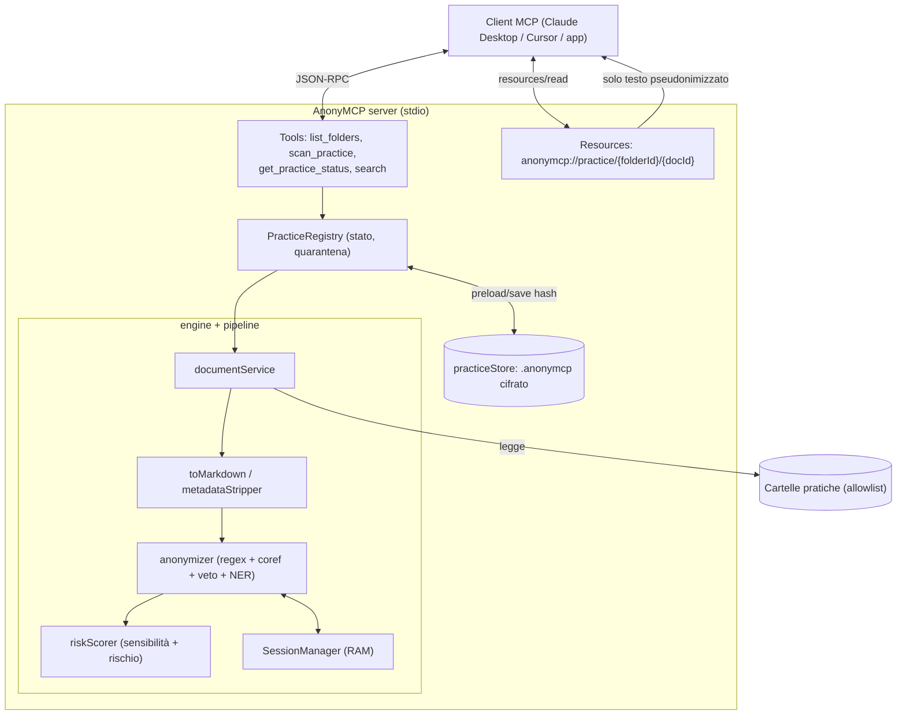
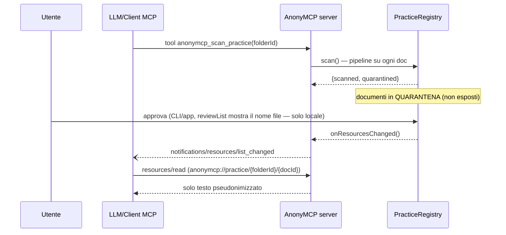
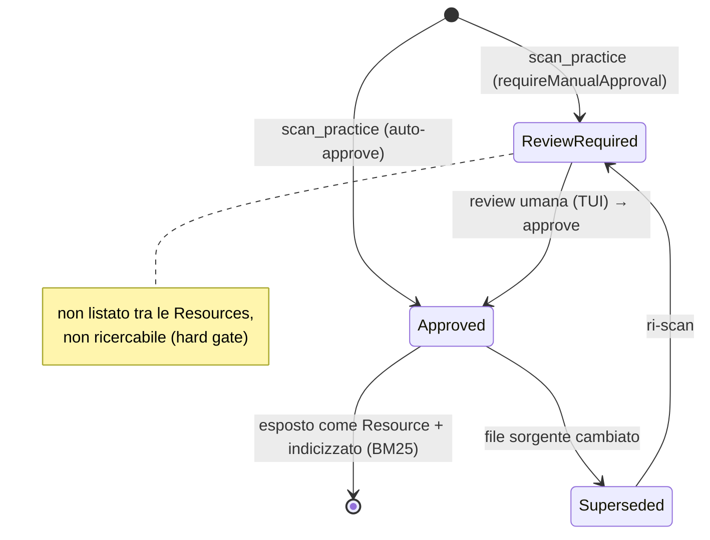

# Architettura di AnonyMCP

Riferimento operativo passo-passo dell'app e del server MCP — pensato per essere usato sia da
una persona sia da un LLM. Per le regole sintetiche vedi [CLAUDE.md](CLAUDE.md); per il
dettaglio, le guide in [docs/agent-guides/](docs/agent-guides/).

## Contents
- 1. Scopo e principio
- 2. Le due fasi
- 3. Architettura a blocchi (diagramma)
- 4. Pipeline di un documento (passo-passo + flowchart)
- 5. Flusso MCP: scan → quarantena → approvazione → read (sequence)
- 6. Stati di un documento (state machine)
- 7. Sicurezza e privacy
- 8. Token-minimization (Fase 2)
- 9. Processo di sviluppo (come è stato costruito)
- 10. Formula consiglio LLM ripetibile
- 11. Limiti noti

---

## 1. Scopo e principio
Server MCP **locale** che **pseudonimizza** i documenti di una pratica *prima* di esporli a un
LLM. È l'utente a scegliere le cartelle. Nulla di sensibile lascia la macchina in chiaro.

> ⚠️ **Pseudonimizzazione, non anonimizzazione** (Garante/EDPB): l'output resta dato personale
> e può consentire re-identificazione da contesto. Vedi §7 e
> [threat-model](docs/agent-guides/threat-model.md).

## 2. Le due fasi
- **Fase 1 (questo repo)** — server MCP stdio standalone, cartelle in `anonymcp.config.json`,
  documenti testuali (`.txt`/`.md`).
- **Fase 2** — app Electron (evoluzione di Anonimator): UI consenso cartelle, log live,
  parser binari (PDF/DOCX/OCR), NER Italian-Legal-BERT in worker, generatori DPIA/registro.
  Perché Electron e non Tauri: il motore è già Node/TS con native pesanti (riuso 1:1; Tauri
  imporrebbe un sidecar Node). Dettaglio nel piano di progetto.

## 3. Architettura a blocchi


## 4. Pipeline di un documento (passo-passo)
Riferimento codice tra parentesi. Ordine **non negoziabile** (anonimizza prima di ogni
artefatto persistente).

```mermaid
flowchart LR
  A["file .txt/.md"] --> B["strip metadati\n(metadataStripper.ts)"]
  B --> C["sanitize Markdown\n(toMarkdown.ts:sanitizeMarkdown)"]
  C --> D["rileva entità\n(anonymizer.ts:detectEntities)"]
  D --> E["risolvi overlap\n(resolveOverlaps)"]
  E --> F["pseudonimi coerenti\n(sessionManager)"]
  F --> G["sostituisci\n(applyPseudonyms)"]
  G --> H["classifica sensibilità\n(riskScorer.classifySensitivity)"]
  H --> I["rischio residuo\n(riskScorer.residualRisk)"]
  I --> J["quarantena → approvazione"]
```



1. **Strip metadati** (`pipeline/metadataStripper.ts`): rimuove autore, timestamp, owner,
   percorsi di rete — spesso più ricchi di PII del testo.
2. **Sanitize** (`pipeline/toMarkdown.ts:sanitizeMarkdown`): NFKC, decode entità HTML, rimozione
   zero-width/tag HTML/link/frontmatter, unione sillabazione. Difende dall'evasione del NER
   (`M**ari**o`, `M<span>ari</span>o`, `M&#97;rio`, …). Avviene **prima** della pseudonimizzazione.
3. **Rileva entità** (`engine/anonymizer.ts:detectEntities`): regex (`regexPatterns.ts`) +
   co-reference (il cognome eredita lo pseudonimo del nome completo) + veto filter
   (`legalStopWords.ts`) + **NER iniettabile** (`NerFn`; Fase 2 = Italian-Legal-BERT).
4. **Overlap** (`resolveOverlaps`): longest-match / priorità tipo (CF batte PARTITA_IVA su uno
   stesso numero).
5. **Pseudonimi** (`engine/sessionManager.ts`): coerenti (stesso testo → stesso pseudonimo),
   solo in RAM. Coerenza tra sessioni via cache cifrata (`preloadByHash`).
6. **Classifica + rischio** (`pipeline/riskScorer.ts`): marca art. 9/10 (penale/salute/minori)
   e calcola un punteggio di re-identificazione residua (R.G./udienza/importi/IBAN).
7. **Quarantena**: il documento non è esposto finché un umano non approva (default).

## 5. Flusso MCP: scan → quarantena → approvazione → read


## 6. Stati di un documento


La revisione umana avviene tramite la TUI di Fase 1 (`npm run review -- --practice <id>`):
lista entità colorata + anteprima Originale/Anonimizzato. Vedi `src/tui/`. Fase 2 = app Electron.

## 7. Sicurezza e privacy
Sintesi; dettaglio in [security-invariants](docs/agent-guides/security-invariants.md) e
[threat-model](docs/agent-guides/threat-model.md).
- Mappa reale↔pseudonimo **solo in RAM**; nessun tool MCP di de-anonimizzazione.
- Cache `.anonymcp` **cifrata** (AES-256-GCM), solo hash, esclusa dalle Resources; invalidata
  se `sourceHash`/`engineVersion` cambiano.
- **docId opaco** (HMAC con chiave di sessione), nessun nome file negli URI.
- **Dati art. 9/10 mai a LLM cloud** (solo LLM locale).
- `pathGuard` (allowlist + no traversal), logging solo su stderr, quarantena di default.

### Obblighi legali (studio legale IT)
Cifratura fascicoli (art. 32), segreto professionale (art. 13 C.D.F.), oscuramento obbligatorio
categorie protette (art. 52 D.Lgs. 196/2003), DPIA per dati penali/sanitari massivi.

## 8. Token-minimization — ricerca BM25 (implementata)
Esponiamo **chunk rilevanti** pseudonimizzati, non documenti interi, indicizzati con **BM25**
(SQLite FTS5; non vettori, over-engineering senza GPU). Vedi `src/search/chunkIndex.ts` e
[ADR-0002](docs/adr/0002-search-bm25.md). Solo i documenti approvati sono indicizzati (hard gate).
Fase 1: tokenizer `unicode61` senza stemming. Fase 2 (da valutare): stemming italiano (Snowball)
e ricerca ibrida BM25+embedding locale. La cifratura dell'indice è opzionale ([ADR-0001](docs/adr/0001-encryption-at-rest-optional.md)).

## 9. Processo di sviluppo (come è stato costruito)
Metodo human-in-the-loop (antirez), commit atomici, decisioni validate da consigli LLM. Storia:
- **Ricerca**: spec MCP 2025-11-25, Electron vs Tauri, Docling/parser, NER italiano, Garante/EDPB.
- **4 consigli LLM** (GPT-5.4, Gemini 3.1 Pro, Kimi K2.6 via Perplexity), ciascuno ha cambiato il progetto:
  1. Architettura → rimossi tool de-anon, documenti come Resources, cache cifrata, quarantena.
  2. Pipeline/sicurezza → anonimizza prima dell'indice, **Docling bocciato** (CVE-2026-24009),
     Markdown sanitizzato, BM25 non vettori.
  3. Alternative + legale → mupdf.js AGPL, **Italian-Legal-BERT**, dati sensibili mai al cloud,
     re-identificazione da contesto/metadati.
  4. Red team dello stato implementato → fix docId/HMAC, preload cache, sanitizer hardening,
     overlap, search guard, threat model.
- Ogni fix = **commit atomico** (revertibile) con test + doc. Dettaglio e formula in
  [development-process](docs/agent-guides/development-process.md).

## 10. Formula consiglio LLM ripetibile
Template vincolante da compilare prima di proporre/valutare una modifica (sintesi; versione
completa in [development-process](docs/agent-guides/development-process.md)):
```
Obiettivo · Invarianti · Minaccia/bug · Patch minima · Test (pos/neg/abuse) ·
Doc update · Rollback · GATE Accept/Reject · Sanity check anti-PII
```
Council multi-modello: `pwm council "<contesto+domande>" -m gpt54,gemini_pro,kimi_k26 -s all`
(su account Pro niente modelli Max-only). Poi **valuti tu** il responso: accogli ciò che riduce
un rischio reale e verificabile, respingi il resto motivando.

## 11. Limiti noti
Verdetto dei consigli: **non deployabile in produzione legale senza remediation**. Mancano
(Fase 2): NER legale validato, keychain OS per la chiave cache, generalizzazione contestuale,
audit trail immutabile + RBAC, parser binari sandboxati, DPIA/registro. Checklist Go/No-Go nel
piano di progetto.
