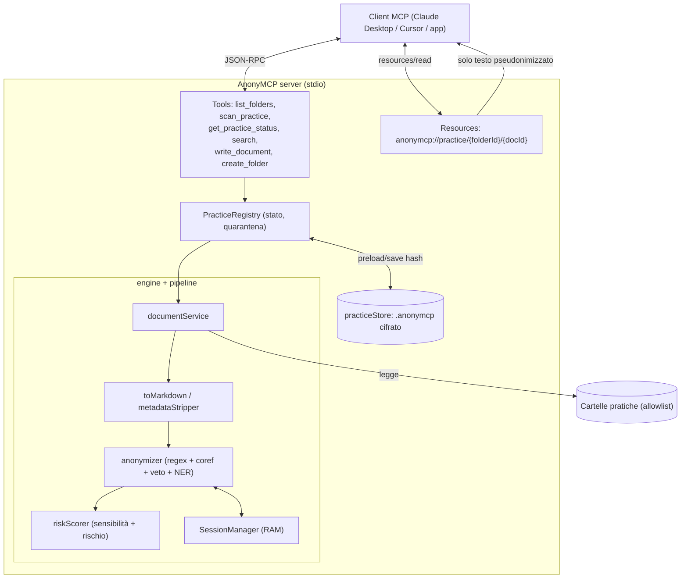
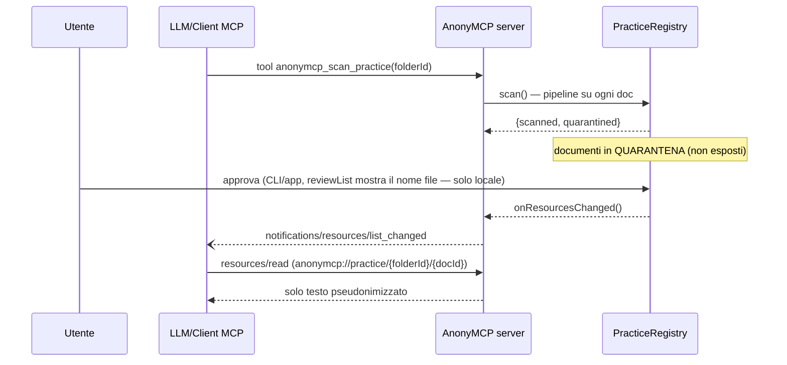
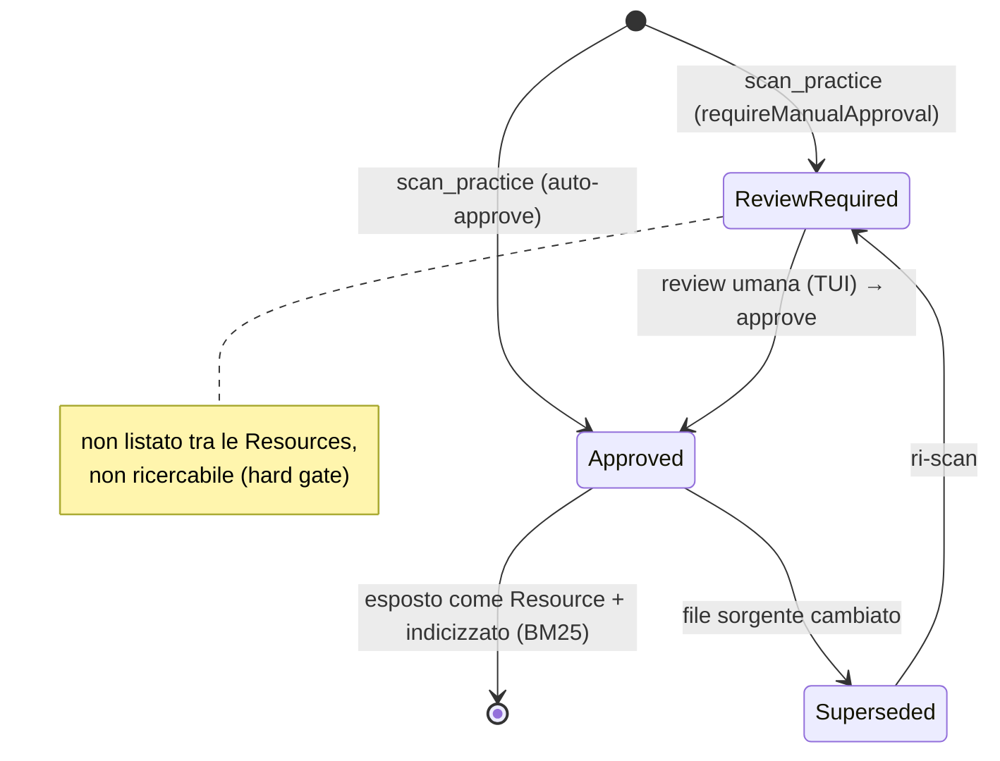

# Architettura di AnonyMCP

Riferimento operativo passo-passo dell'app e del server MCP — pensato per essere usato sia da
una persona sia da un LLM. Per le regole sintetiche vedi [CLAUDE.md](CLAUDE.md); per il
dettaglio, le guide in [docs/agent-guides/](docs/agent-guides/).

## Contents
- 1. Scopo e principio
- 2. Le due fasi
- 3. Architettura a blocchi (diagramma)
- 4. Pipeline di un documento (passo-passo + flowchart)
- 5. Flusso MCP: scan → quarantena → approvazione → read (sequence)
- 6. Stati di un documento (state machine)
- 6-bis. Persistenza: perché esiste e cosa verifica
- 6-ter. Navigazione UI Electron locale
- 7. Sicurezza e privacy
- 8. Token-minimization (Fase 2)
- 9. Processo di sviluppo (come è stato costruito)
- 10. Formula consiglio LLM ripetibile
- 11. Release e aggiornamenti
- 12. Limiti noti

---

## 1. Scopo e principio
Server MCP **locale** che **pseudonimizza** i documenti di una pratica *prima* di esporli a un
LLM. È l'utente a scegliere le cartelle. Nulla di sensibile lascia la macchina in chiaro.

> ⚠️ **Pseudonimizzazione, non anonimizzazione** (Garante/EDPB): l'output resta dato personale
> e può consentire re-identificazione da contesto. Vedi §7 e
> [threat-model](docs/agent-guides/threat-model.md).

## 2. Le due fasi
- **Fase 1 (questo repo)** — server MCP stdio standalone, cartelle in `anonymcp.config.json`,
  documenti testuali (`.txt`/`.md`).
- **Fase 2** — app Electron (evoluzione di Anonimator): dashboard locale, top nav operativa
  (`Dashboard`, `Review`, `Bloccati`, `Bozze`, `Scansione`), consenso cartelle, log live,
  parser binari (PDF/DOCX/OCR), NER `italian-ner-xxl-v2` in worker, generatori DPIA/registro.
  Perché Electron e non Tauri: il motore è già Node/TS con native pesanti (riuso 1:1; Tauri
  imporrebbe un sidecar Node). Dettaglio nel piano di progetto.

## 3. Architettura a blocchi


## 4. Pipeline di un documento (passo-passo)
Riferimento codice tra parentesi. Ordine **non negoziabile** (anonimizza prima di ogni
artefatto persistente).

```mermaid
flowchart LR
  A["file .txt/.md"] --> B["strip metadati\n(metadataStripper.ts)"]
  B --> C["sanitize Markdown\n(toMarkdown.ts:sanitizeMarkdown)"]
  C --> D["rileva entità\n(anonymizer.ts:detectEntities)"]
  D --> E["risolvi overlap\n(resolveOverlaps)"]
  E --> F["pseudonimi coerenti\n(sessionManager)"]
  F --> G["sostituisci\n(applyPseudonyms)"]
  G --> H["classifica sensibilità\n(riskScorer.classifySensitivity)"]
  H --> I["rischio residuo\n(riskScorer.residualRisk)"]
  I --> J["quarantena → approvazione"]
```



1. **Strip metadati** (`pipeline/metadataStripper.ts`): rimuove autore, timestamp, owner,
   percorsi di rete — spesso più ricchi di PII del testo.
2. **Sanitize** (`pipeline/toMarkdown.ts:sanitizeMarkdown`): NFKC, decode entità HTML, rimozione
   zero-width/tag HTML/link/frontmatter, unione sillabazione. Difende dall'evasione del NER
   (`M**ari**o`, `M<span>ari</span>o`, `M&#97;rio`, …). Avviene **prima** della pseudonimizzazione.
3. **Rileva entità** (`engine/anonymizer.ts:detectEntities`): regex (`regexPatterns.ts`) +
   co-reference (il cognome eredita lo pseudonimo del nome completo) + veto filter
   (`legalStopWords.ts`) + **NER iniettabile** (`NerFn`; Fase 2 = `italian-ner-xxl-v2`,
   vedi [ADR-0007](docs/adr/0007-ner-model-target.md)).
4. **Overlap** (`resolveOverlaps`): longest-match / priorità tipo (CF batte PARTITA_IVA su uno
   stesso numero).
5. **Pseudonimi** (`engine/sessionManager.ts`): coerenti (stesso testo → stesso pseudonimo),
   solo in RAM. Coerenza tra sessioni via cache cifrata (`preloadByHash`).
6. **Classifica + rischio** (`pipeline/riskScorer.ts`): marca art. 9/10 (penale/salute/minori)
   e calcola un punteggio di re-identificazione residua (R.G./udienza/importi/IBAN).
7. **Quarantena**: il documento non è esposto finché un umano non approva (default).

## 5. Flusso MCP: scan → quarantena → approvazione → read


## 5-bis. Flusso M-Write: l'LLM produce, l'MCP salva (re-idratato)
L'LLM legge i documenti pseudonimizzati e può produrre bozze (atti, contratti, ricerche). L'LLM
**non tocca mai il disco**: chiama `anonymcp_write_document(folderId, relPath, content)` e l'MCP
scrive nella pratica. Vedi [ADR-0005](docs/adr/0005-mcp-write-rehydration.md). Solo formati
testuali (`.md/.txt/.tex/.csv/.json/.xml/.html`); i binari sono una milestone futura.
```mermaid
sequenceDiagram
  participant L as LLM/Client MCP
  participant S as AnonyMCP server
  participant Sess as SessionManager (RAM)
  participant U as Utente (TUI)
  L->>S: write_document(folderId, relPath, content con pseudonimi)
  S->>S: pathGuard (relPath dentro la pratica) + allowlist estensioni
  S->>Sess: rehydrate(content) — pseudonimo→reale (LOCALE, mai esposto)
  Note over Sess: co-reference collassata via entityId;\nambiguità → fail-safe (non sostituita)
  S->>S: scrive in .anonymcp-staging/ (se requireManualApproval)
  S-->>L: {staged, relPath, rehydratedEntities, ambiguousPlaceholders} — NO PII
  U->>S: conferma in TUI → promoteWrite (staging → destinazione finale)
```
Il testo **re-idratato** (con i nomi reali) finisce su disco solo dopo la conferma umana; la
risposta verso l'LLM non contiene mai dati reali. La re-idratazione è un passaggio **locale**
lato server (non un tool MCP di de-anonimizzazione): la co-reference ("Mario Rossi" e "Rossi")
è risolta tramite un **id-entità interno** (RAM-only) e la forma canonica; un cognome condiviso
da più persone non viene ri-idratato (fail-safe) ed è segnalato.

## 6. Stati di un documento


La revisione umana avviene tramite la TUI di Fase 1 (`npm run review -- --practice <id>`):
lista entità colorata + anteprima Originale/Anonimizzato. Vedi `src/tui/`. Fase 2 = app Electron,
con coda `Review` locale e dettaglio documento che distingue `Originale locale` e
`Pseudonimizzato`.

## 6-bis. Persistenza: perché esiste e cosa verifica
La persistenza serve a non ricominciare da zero ogni volta che il server MCP viene spento e
riacceso. In una pratica legale gli stessi soggetti compaiono in più documenti e in più giorni:
se oggi "Mario Rossi" diventa "M. R.", domani deve restare "M. R.". Altrimenti il LLM leggerebbe
una pratica incoerente, come se ogni riavvio cambiasse le etichette sulle cartelle.

Metafora semplice: AnonyMCP ha una memoria locale di studio, non una memoria da mandare al
consulente esterno. La memoria locale ricorda che cosa è stato già controllato e quali
pseudonimi usare; il consulente esterno, cioè il LLM cloud, riceve solo i fogli già coperti.

La persistenza è stata fatta per tre motivi pratici:
- **Coerenza degli pseudonimi**: la stessa entità deve avere lo stesso pseudonimo tra documenti e
  tra sessioni, altrimenti la pratica diventa difficile da leggere.
- **Quarantena affidabile**: se l'avvocato approva un documento, il server riavviato deve ricordare
  quell'approvazione; se il documento cambia, l'approvazione deve decadere automaticamente.
- **Lavoro umano non perso**: correzioni manuali, decisioni sulla sensibilità e bozze LLM in
  attesa devono restare disponibili alla UI locale anche dopo un riavvio.

Cosa viene persistito, in pratica:
- `pratica.anonymcp`: cache cifrata con soli hash e pseudonimi. Serve per coerenza, non contiene il
  testo reale.
- `pratica.entitydict.json`: dizionario locale della pratica con originali e pseudonimi. È come una
  rubrica di studio: resta accanto ai documenti originali e non viene mai esposto via MCP.
- `pratica.approvals.json`: registro delle approvazioni umane, legato all'hash del contenuto. Se il
  file cambia, cambia l'hash e il documento torna in review.
- `pratica.sensitivity.json`: decisioni locali dell'avvocato sulla sensibilità del documento.
- `pratica.writes.json` + `.anonymcp-staging/`: bozze prodotte dall'LLM, re-idratate localmente e in
  attesa di conferma umana.

Attività svolte per verificare e rafforzare questa persistenza:
- Aggiunti test su cache cifrata, cache corrotta e cambio `engineVersion`, per verificare che una
  memoria vecchia o illeggibile venga ignorata senza crash e senza leak.
- Aggiunti test su approvazioni persistite, approvazioni corrotte e documenti cancellati, per
  garantire il comportamento fail-closed: senza approvazione valida, niente Resource e niente search.
- Aggiunto un test MCP con nuova istanza server, per simulare il riavvio logico e verificare che
  pseudonimi e approvazioni siano ancora coerenti.
- Aggiunti test su pending write, per verificare che una bozza in staging resti visibile alla UI
  locale dopo una nuova istanza.
- Aggiunti test red-team su symlink e artefatti interni, per impedire che il server legga o scriva
  fuori dalla pratica o sovrascriva file come dizionario, approvazioni, indice e staging.
- Aggiunti test su query di ricerca identificanti (nome persona, R.G., targa), per evitare che il
  tool `search` venga usato per confermare la presenza di dati reali.
- Aggiunto un controllo sul dizionario locale: una voce avvelenata che usa il testo reale come
  pseudonimo viene scartata.

Il criterio guida resta semplice: la persistenza è utile solo se riduce errori e lavoro ripetuto
senza aumentare ciò che esce verso il LLM. Se un dato serve solo localmente, resta locale; se un
dato attraversa MCP, deve essere pseudonimizzato, approvato e non bloccato dalla policy sui dati
sensibili.

## 6-ter. Navigazione UI Electron locale

L'app Electron e' una UI locale sopra i servizi gia' descritti; non aggiunge canali MCP e non
modifica i gate di esposizione. La top nav divide il lavoro operativo in cinque pagine:

- `Dashboard`: situazione attuale dell'MCP locale e prossime azioni; mostra config UI, hash e
  `folderId` opachi, piu' il warning sulla possibile divergenza dal client LLM collegato.
- `Review`: coda dei documenti da controllare; puo' aprire il dettaglio con testo originale reale,
  ma solo nella UI locale.
- `Bloccati`: documenti non disponibili via MCP/LLM per sensibilita' o policy, anche se gia'
  approvati localmente.
- `Bozze`: bozze LLM da confermare; generate sui pseudonimi e completate localmente con i dati
  reali prima del salvataggio nella pratica.
- `Scansione`: ricerca locale di nuovi documenti nelle pratiche; prepara review/quarantena e non
  espone nulla via MCP/LLM.

I badge della nav sono orientativi: indicano lavoro locale o stato in corso, non approvazione e
non disponibilita' cloud. Le etichette corte (`Bloccati`, `Bozze`, `Scansione`) devono avere testo
visibile o accessibile che le espanda in `Bloccati MCP/LLM`, `Bozze locali` e `Scansione locale`.

## 7. Sicurezza e privacy
Sintesi; dettaglio in [security-invariants](docs/agent-guides/security-invariants.md) e
[threat-model](docs/agent-guides/threat-model.md).
- Mappa reale↔pseudonimo **solo in RAM**; nessun tool MCP di de-anonimizzazione.
- Cache `.anonymcp` **cifrata** (AES-256-GCM), solo hash, esclusa dalle Resources; invalidata
  se `sourceHash`/`engineVersion` cambiano.
- **docId opaco** (HMAC con chiave di sessione), nessun nome file negli URI.
- **Dati art. 9/10 mai a LLM cloud**: con `allowCloudForSensitive=false` un documento sensibile
  può risultare approvato dall'umano, ma non è Resource, non è leggibile per URI diretto e non
  entra nell'indice di ricerca.
- `pathGuard` (allowlist + no traversal), logging solo su stderr, quarantena di default.
- **Scrittura (M-Write)**: la re-idratazione (pseudonimo→reale) è LOCALE, mai esposta via MCP;
  il return all'LLM è privo di PII; staging + conferma umana prima del salvataggio definitivo;
  ambiguità di entità → fail-safe (non ri-idratata + segnalazione). Vedi ADR-0005.

### Obblighi legali (studio legale IT)
Cifratura fascicoli (art. 32), segreto professionale (art. 13 C.D.F.), oscuramento obbligatorio
categorie protette (art. 52 D.Lgs. 196/2003), DPIA per dati penali/sanitari massivi.

## 8. Token-minimization — ricerca BM25 (implementata)
Esponiamo **chunk rilevanti** pseudonimizzati, non documenti interi, indicizzati con **BM25**
(SQLite FTS5; non vettori, over-engineering senza GPU). Vedi `src/search/chunkIndex.ts` e
[ADR-0002](docs/adr/0002-search-bm25.md). Solo i documenti approvati e consentiti dalla policy
cloud sono indicizzati (hard gate).
Fase 1: tokenizer `unicode61` senza stemming. Fase 2 (da valutare): stemming italiano (Snowball)
e ricerca ibrida BM25+embedding locale. La cifratura dell'indice è opzionale ([ADR-0001](docs/adr/0001-encryption-at-rest-optional.md)).

## 9. Processo di sviluppo (come è stato costruito)
Metodo human-in-the-loop (antirez), commit atomici, decisioni validate da consigli LLM. Storia:
- **Ricerca**: spec MCP 2025-11-25, Electron vs Tauri, Docling/parser, NER italiano, Garante/EDPB.
- **4 consigli LLM** (GPT-5.4, Gemini 3.1 Pro, Kimi K2.6 via Perplexity), ciascuno ha cambiato il progetto:
  1. Architettura → rimossi tool de-anon, documenti come Resources, cache cifrata, quarantena.
  2. Pipeline/sicurezza → anonimizza prima dell'indice, **Docling bocciato** (CVE-2026-24009),
     Markdown sanitizzato, BM25 non vettori.
  3. Alternative + legale → mupdf.js AGPL, NER locale, dati sensibili mai al cloud,
     re-identificazione da contesto/metadati.
  4. Red team dello stato implementato → fix docId/HMAC, preload cache, sanitizer hardening,
     overlap, search guard, threat model.
  5. Red team M-Write/review → fix entità manuali su testo canonico, enforcement
     `allowCloudForSensitive`, hash staging, selezione TUI applicata, warning su `folderId`,
     ADR-0007.
- Ogni fix = **commit atomico** (revertibile) con test + doc. Dettaglio e formula in
  [development-process](docs/agent-guides/development-process.md).

## 10. Formula consiglio LLM ripetibile
Template vincolante da compilare prima di proporre/valutare una modifica (sintesi; versione
completa in [development-process](docs/agent-guides/development-process.md)):
```
Obiettivo · Invarianti · Minaccia/bug · Patch minima · Test (pos/neg/abuse) ·
Doc update · Rollback · GATE Accept/Reject · Sanity check anti-PII
```
Council multi-modello: `pwm council "<contesto+domande>" -m gpt54,gemini_pro,kimi_k26 -s all`
(su account Pro niente modelli Max-only). Poi **valuti tu** il responso: accogli ciò che riduce
un rischio reale e verificabile, respingi il resto motivando.

## 11. Release e aggiornamenti

Le beta pubbliche usano SemVer con suffisso pre-release, per esempio `0.1.1-beta.1`, e vanno
pubblicate come GitHub `pre-release`. La finale della stessa linea rimuove il suffisso, per
esempio `0.1.1`, solo dopo approvazione umana dell'ultima beta e senza modifiche funzionali nuove.

La distinzione beta/finale e' una distinzione di release, non una deroga agli invarianti: una finale
`0.y.z` non implica produzione legale se roadmap o threat model mantengono blocker aperti. Guida
canonica: [release-and-update-guidelines](docs/agent-guides/release-and-update-guidelines.md).

## 12. Limiti noti
Verdetto dei consigli: **non deployabile in produzione legale senza remediation**. Mancano
(Fase 2): NER locale validato (`italian-ner-xxl-v2` come target iniziale), keychain OS per la chiave cache, generalizzazione contestuale,
audit trail immutabile + RBAC, parser binari sandboxati, DPIA/registro. Checklist Go/No-Go nel
piano di progetto.
