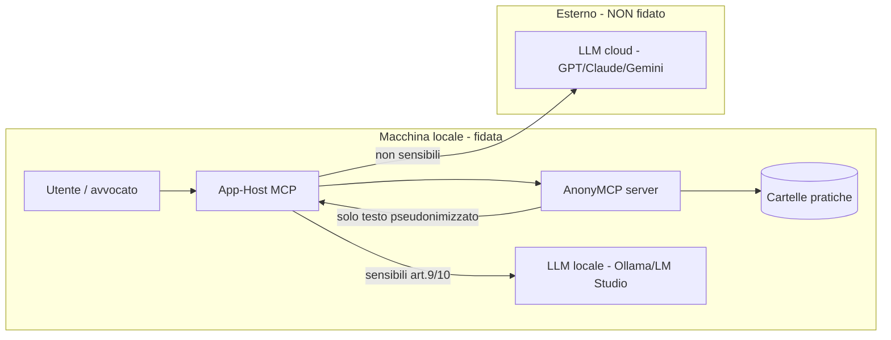

# Threat model (STRIDE) — AnonyMCP

## Contents
- Perimetro e attori
- Asset da proteggere
- Analisi STRIDE per componente
- Gap residui noti (→ Fase 2)
- Suite di test red-team

## Perimetro e attori
AnonyMCP gira **in locale** (stdio) accanto ai documenti dell'utente. Confini di fiducia:

Attori ostili considerati: **host MCP malevolo**; **documento con prompt-injection**;
**utente locale curioso**; **malware locale**; **sync cloud accidentale** della cartella.

## Asset da proteggere
1. Testo originale dei documenti (dato personale, spesso art. 9/10).
2. Mappa reale↔pseudonimo (consente la re-identificazione).
3. Chiave di cifratura della cache.
4. Nomi file e metadati (re-identificazione indiretta).

## Analisi STRIDE per componente

| Componente | Minaccia (STRIDE) | Vettore | Mitigazione presente | Gap residuo |
|---|---|---|---|---|
| **Resources** | Information disclosure | URI con nome file reale; documento cancellato ma ancora in RAM | docId = HMAC, niente nome/estensione (`practiceRegistry.docIdFor`); esposizione solo se `isExposable`; `scan()` ritira da RAM/indice i documenti non piu' presenti/supportati | — |
| **Tool de-anon** | Elevation/Disclosure | LLM chiama get_mapping via prompt-injection | tool **inesistenti**; mappa solo in RAM | de-anon proxy = Fase 2 |
| **Cache `.anonymcp`** | Tampering/Disclosure | lettura/modifica del file | AES-256-GCM (auth), solo hash, no PII (`practiceStore`) | chiave in env (Fase 1) → keychain OS in Fase 2 |
| **SessionManager** | Disclosure | memory/crash dump | solo RAM, `reset()` zeroization | dump del processo (mitigare in Fase 2) |
| **Pipeline NER** | Disclosure (leak) | offuscamento per evadere il NER | `sanitizeMarkdown` (zero-width/entity/NFKC/hyphenation) + quarantena | NER regex-only: recall imperfetto → `italian-ner-xxl-v2` in worker locale (ADR-0007) |
| **search** | Disclosure (inference) | query = dato reale per confermarne la presenza | guard anti-PII su identificatori formali, RG, targhe e query person-like; ricerca su testo già pseudonimizzato; errore senza echo della query PII | residuo: euristiche anti-PII non equivalgono a NER completo della query |
| **pathGuard** | Tampering/Disclosure | directory traversal / URI fuori allowlist; symlink che punta fuori pratica | `assertAllowed` + blocco artefatti interni; scan rifiuta symlink file; M-Write rifiuta segmenti symlink esistenti | RT-01 residuo: estendere `realpath`/`lstat` anche ai flussi di import/allowlist non MCP |
| **M-Write** | Tampering/Disclosure | relPath verso artefatti interni o directory symlink; overwrite di store locali | path relativo, estensioni testuali, blocklist store/DB AnonyMCP, staging + hash + review locale, symlink target rifiutati | — |
| **Electron UI/IPC** | Spoofing/Elevation/Disclosure | renderer navigato a pagina locale diversa che invoca IPC; console renderer con PII | `contextIsolation`, `sandbox`, `nodeIntegration=false`, CSP, preload nominale, Zod | RT-04: trust solo dell'esatto renderer packaged, non ogni `file://`; RT-08: redazione log renderer-forwarded |
| **Dashboard / stato UI** | Spoofing (falso senso di sicurezza) | badge di stato generico suggerisce un collegamento client→server che non viene verificato; config UI (`userData`) può divergere da quella del server reale (`ANONYMCP_CONFIG`) | badge `Config UI pronta` + banner ambra di avviso divergenza (`App.tsx`); `mcpReady` riflette solo la presenza di cartelle in config | RT-09: badge onesto su ciò che misura + verifica/visibilità della divergenza config UI↔server |
| **stdio** | Tampering (protocollo) | log su stdout rompe JSON-RPC | logger **solo stderr** | — |
| **Documento** | Spoofing/Elevation | prompt-injection nel contenuto | contenuto trattato come dato non-fidato; nessuna esecuzione server-side | difesa a livello host/LLM |
| **Endpoint LLM** | Disclosure | dato sensibile inviato al cloud | `allowCloudForSensitive=false` blocca Resource/read/search dei documenti sensibili | routing esplicito LLM locale/cloud nella app Fase 2 |

## Gap residui noti (→ Fase 2)
- Chiave cache da **keychain OS** (ora da `ANONYMCP_CACHE_KEY`); rotazione chiave prima del
  limite nonce GCM (~2^32 messaggi/chiave; con IV random e volumi legali è teorico).
- NER locale `italian-ner-xxl-v2` (ADR-0007) + benchmark recall/precision su corpus reale.
- Audit trail immutabile + RBAC; generalizzazione contestuale (RG/udienza/importi) resta
  un gap. RT-06 chiuso (ADR-0008): oltre soglia `residualRisk` l'approvazione richiede
  conferma esplicita persistita; approvazioni storiche senza conferma decadono fail-closed.
- Parser binari (PDF/DOCX/OCR) in **sandbox/worker** isolato.
- RT-01 residuo: filesystem symlink-aware (`realpath`/`lstat`) da estendere ai flussi di import/allowlist
  non MCP; scan e M-Write hanno test di rifiuto symlink.
- RT-04/RT-08: hardening Electron runtime: renderer URL esatto, dev origin normalizzato, log
  renderer redatti e test su pagina `file://` non fidata.
- RT-05: import label come allowlist stretta, non euristica permissiva; config manuale resta
  warning secondo ADR-0004 finche' non c'e' nuovo ADR.
- RT-09: il badge `Config UI pronta` misura solo `config.folders.length > 0`, non il
  collegamento reale del client né l'allineamento tra config UI (`userData`) e config del server
  (`ANONYMCP_CONFIG`). Rendere il badge onesto e segnalare/verificare la divergenza; valutare
  auto-config dei client con sorgente unica (dettaglio e formati in `ROADMAP-fase2.md`).

## Suite di test red-team
- `test/redteam.docid.test.ts` — non-invertibilità/opacità del docId.
- `test/redteam.sanitizer.test.ts` — fuzzing anti-evasione del sanitizer (7 offuscatori).
- `test/redteam.search.test.ts` — guard anti-PII + non-leak dei nomi file.
- `test/fixtures.antileak.test.ts` — nessuna entità reale dei fixture nell'output.
- `test/redteam.filesystem.test.ts` — scan ignora symlink fuori pratica.
- `test/approvalPersistence.test.ts` — approvazioni fail-closed e ritiro documenti cancellati.
- `test/writeService.test.ts` — M-Write blocca artefatti interni e symlink, pending write persistenti.
- `test/residualRiskAck.test.ts` — RT-06: conferma esplicita oltre soglia di rischio residuo,
  decadenza fail-closed delle approvazioni storiche senza conferma (ADR-0008).
- `test/folderImport.test.ts` — RT-05: corpus label opache positivo/negativo (allowlist forte,
  nomi identificanti rigenerati, collisioni case-insensitive).
- `test/electronSecurity.test.ts` — RT-04/RT-08: trusted renderer URL (solo packaged
  `index.html` ammesso, `file:///tmp/malicious.html` rifiutato; origin normalizzato in dev) e
  log console renderer senza argomenti potenzialmente PII.

> Nota: la suite funzionale/anti-leak non e' una garanzia di sicurezza. Prima del deploy in
> produzione legale, eseguire un pentest e completare la checklist Go/No-Go (vedi piano).
