# Guida alla beta desktop di AnonyMCP per avvocati

Questa guida accompagna il primo uso dell'app desktop AnonyMCP.

> **Beta di test.** Non usare questa versione con pratiche reali o documenti sensibili di
> clienti. Provala solo con cartelle di test o documenti sintetici.

AnonyMCP serve a una cosa precisa: ridurre il rischio che dati personali in chiaro finiscano in
un LLM cloud. Non rende i documenti "anonimi per sempre": li pseudonimizza e chiede una review
umana prima di esporre qualunque testo tramite MCP.

## Il percorso dei documenti

Tieni separati questi tre livelli:

- **Originale locale**: il documento vero resta sul computer.
- **Review umana**: l'avvocato controlla entita', sensibilita' e anteprima pseudonimizzata.
- **LLM cloud**: puo' leggere solo testo pseudonimizzato, approvato e consentito dalla policy.

Un documento **approvato localmente** non e' automaticamente **disponibile al LLM cloud**. Se e'
sensibile o bloccato dalla policy, resta nella UI locale.

## 1. Leggi l'avviso privacy

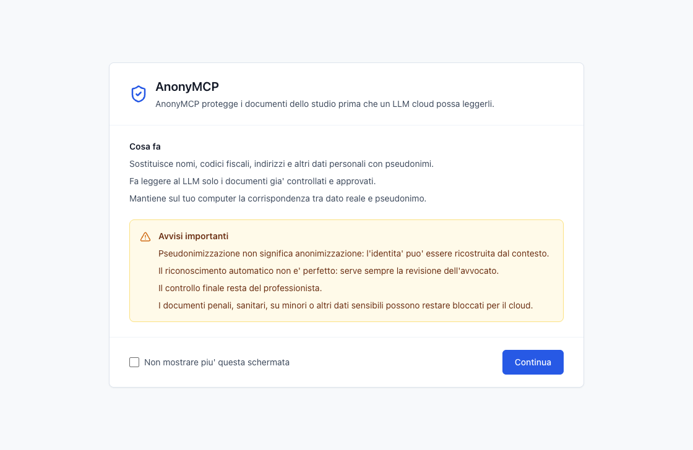

**Cosa stai vedendo**

L'app ricorda che AnonyMCP sostituisce dati personali con pseudonimi e che la corrispondenza tra
dati reali e pseudonimi resta sul computer.

**Cosa devi controllare**

Leggi soprattutto gli avvisi: pseudonimizzazione non significa anonimizzazione e il riconoscimento
automatico puo' sbagliare.

**Errore da evitare**

Non considerare l'app come un automatismo che autorizza l'invio al cloud. La decisione finale resta
del professionista.

## 2. Aggiungi pratiche di test

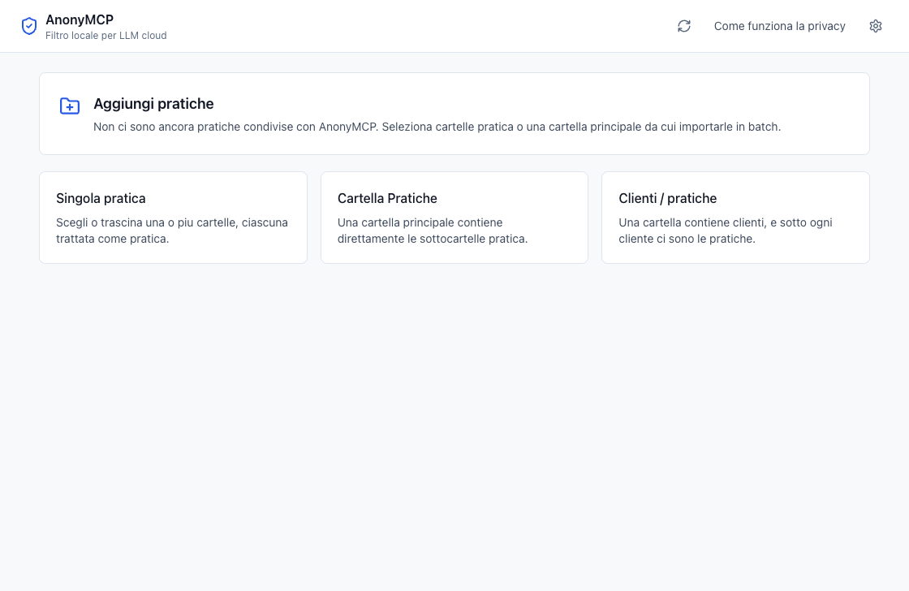

**Cosa stai vedendo**

Quando non ci sono pratiche configurate, l'app propone tre modi per aggiungere cartelle:
singola pratica, cartella principale delle pratiche, oppure struttura clienti/pratiche.

**Cosa devi controllare**

Per una prova iniziale scegli cartelle sintetiche o copie di test. I codici pratica esposti al
canale MCP devono essere opachi, per esempio `400F` o `P001`, non nomi delle parti.

**Errore da evitare**

Non importare una cartella reale dello studio durante i test della beta.

## 3. Controlla la configurazione locale

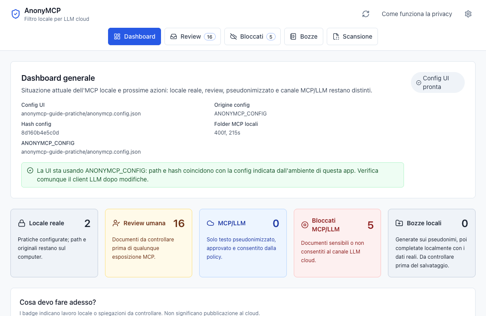

**Cosa stai vedendo**

La dashboard mostra la configurazione caricata dalla UI, l'origine della config, i folder MCP
locali e i conteggi principali.

**Cosa devi controllare**

Verifica che la config sia quella che vuoi usare. Se colleghi un client LLM, anche quel client deve
puntare allo stesso file di configurazione.

**Errore da evitare**

Non fidarti solo del badge "Config UI pronta": indica che la UI ha una config, non che il client LLM
sia gia' stato verificato.

## 4. Leggi i contatori della dashboard

Nella dashboard guarda i riquadri in questa sequenza:

- **Locale reale**: pratiche configurate sul computer.
- **Review umana**: documenti da controllare.
- **MCP/LLM**: documenti gia' disponibili al canale esterno.
- **Bloccati MCP/LLM**: documenti sensibili o non consentiti al cloud.
- **Bozze locali**: testi da confermare prima del salvataggio nella pratica.

**Errore da evitare**

Un numero alto in "Review umana" non significa che quei documenti siano gia' esposti. Significa il
contrario: sono ancora da controllare.

## 5. Cerca nuovi documenti

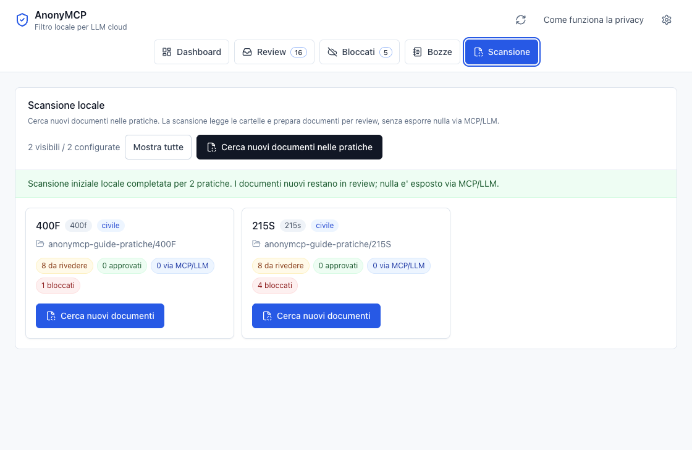

**Cosa stai vedendo**

La pagina Scansione legge le cartelle configurate e prepara i documenti per la review.

**Cosa devi controllare**

Il messaggio deve dire che i documenti nuovi restano in review e che nulla viene esposto via
MCP/LLM senza controllo.

**Errore da evitare**

Non scambiare la scansione per una pubblicazione al cloud. La scansione e' un passaggio locale.

## 6. Apri la coda review

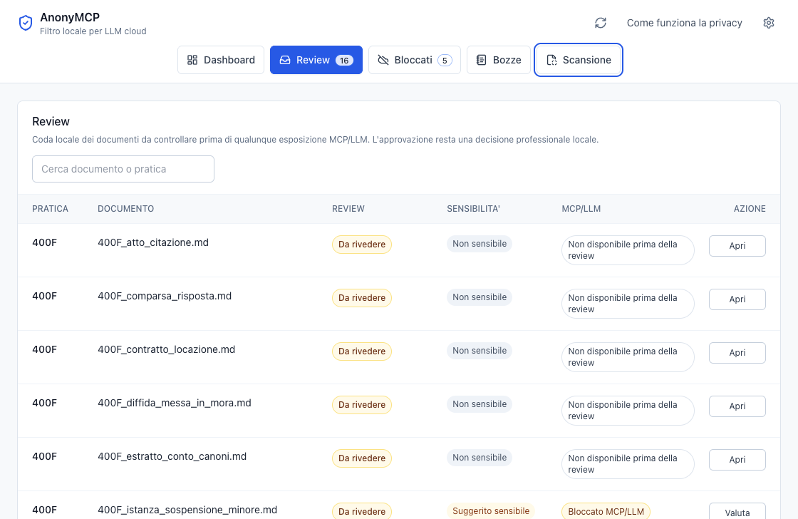

**Cosa stai vedendo**

La tabella mostra pratica, documento, stato review, sensibilita', disponibilita' MCP/LLM e azione.

**Cosa devi controllare**

Leggi sempre la colonna **MCP/LLM**. Un documento "Da rivedere" deve essere "Non disponibile prima
della review" oppure "Bloccato MCP/LLM" se sensibile.

**Errore da evitare**

Non approvare in blocco senza aprire i documenti: la review serve proprio a trovare entita' mancanti
o dati sensibili.

## 7. Rivedi un documento

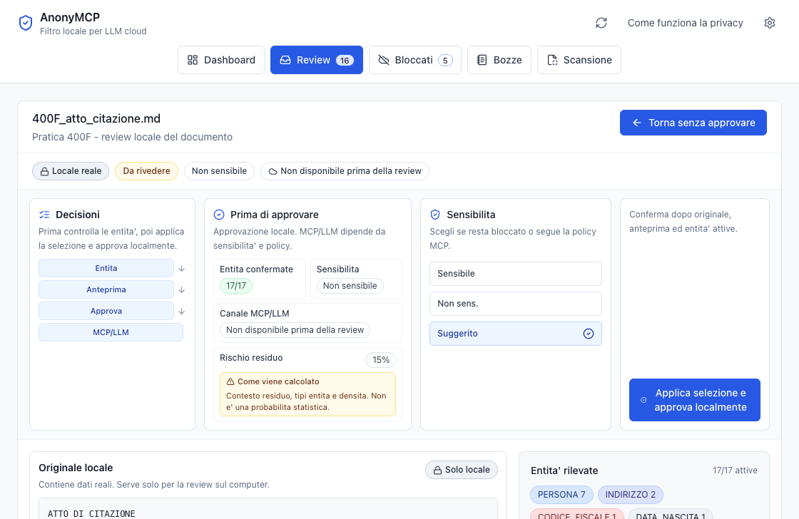

**Cosa stai vedendo**

La parte alta della review riassume stato locale, stato review, sensibilita' e canale MCP/LLM.
Il riquadro "Prima di approvare" mostra quanti elementi sono confermati e se il documento puo'
diventare disponibile al canale esterno.

**Cosa devi controllare**

Prima di approvare verifica:

- entita' confermate;
- sensibilita';
- canale MCP/LLM;
- rischio residuo;
- pulsante finale "Applica selezione e approva localmente".

**Errore da evitare**

Il pulsante approva localmente. La disponibilita' al LLM dipende ancora da sensibilita' e policy.

## 8. Confronta originale e pseudonimizzato

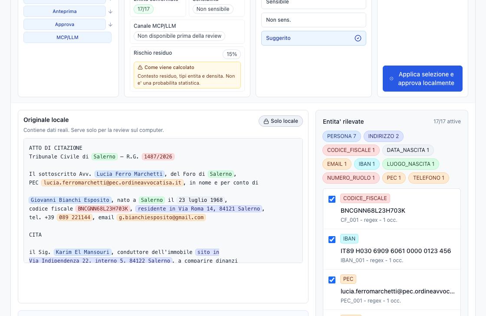

**Cosa stai vedendo**

Il riquadro "Originale locale" contiene testo reale, usato solo per la review sul computer. A destra
vedi le entita' rilevate: tipo, valore originale, pseudonimo, fonte e occorrenze.

**Cosa devi controllare**

Controlla nomi, codici fiscali, indirizzi, email, PEC, telefoni, IBAN, numeri di ruolo e ogni altro
riferimento identificativo.

**Errore da evitare**

Non fidarti solo dei colori: leggi la lista delle entita' e aggiungi manualmente quello che manca.

## 9. Controlla l'anteprima pseudonimizzata

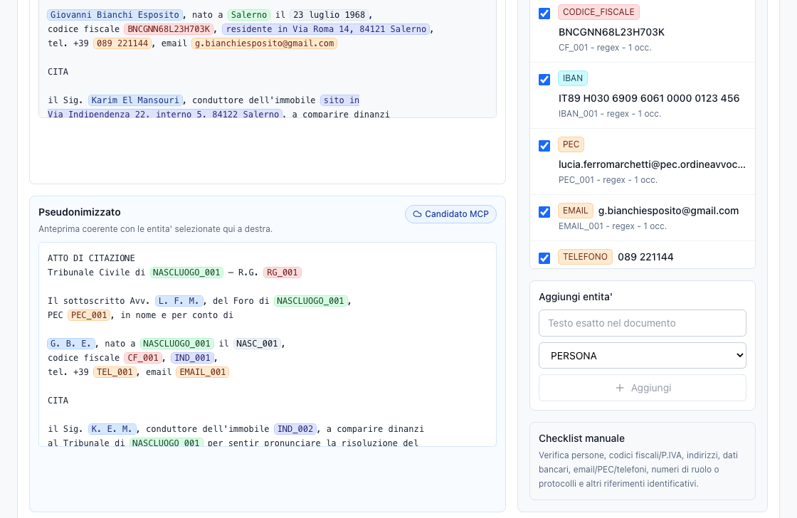

**Cosa stai vedendo**

L'anteprima mostra il testo che potrebbe diventare candidato al canale MCP, con pseudonimi al posto
dei dati reali selezionati.

**Cosa devi controllare**

Se nell'anteprima vedi ancora un dato personale in chiaro, torna alla lista entita' e aggiungilo o
riattivalo prima di approvare.

**Errore da evitare**

Non approvare se l'anteprima contiene nomi, codici fiscali, indirizzi o altri dati reali che non
devono uscire dal computer.

## 10. Gestisci i documenti sensibili

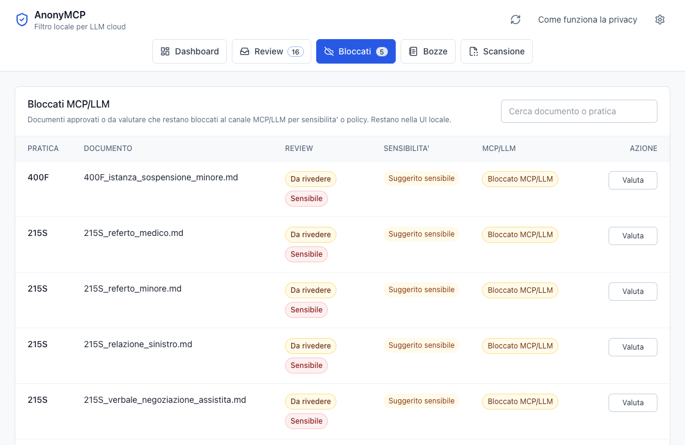

**Cosa stai vedendo**

La pagina "Bloccati" elenca documenti che sono sensibili o non consentiti al canale MCP/LLM. Restano
nella UI locale.

**Cosa devi controllare**

Guarda la colonna **Sensibilita'** e la colonna **MCP/LLM**. Se compare "Bloccato MCP/LLM", il
documento non viene dato al LLM cloud.

**Errore da evitare**

Non confondere "Da rivedere" con "sicuro per il cloud". I documenti sensibili richiedono una
decisione professionale specifica.

## 11. Review di un documento sensibile

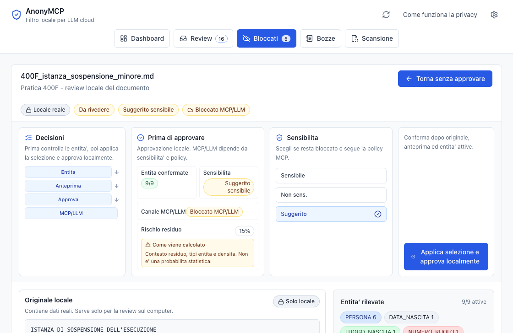

**Cosa stai vedendo**

Il documento e' suggerito come sensibile e il canale MCP/LLM risulta bloccato. La review resta
locale: puoi controllare il documento senza renderlo disponibile al cloud.

**Cosa devi controllare**

Se scegli "Non sensibile", stai assumendo una decisione professionale sul contesto. Per default,
mantieni il suggerimento prudente quando il dubbio resta.

**Errore da evitare**

Non usare la review locale come scorciatoia per sbloccare documenti penali, sanitari, su minori o
comunque delicati.

## 12. Bozze LLM da confermare

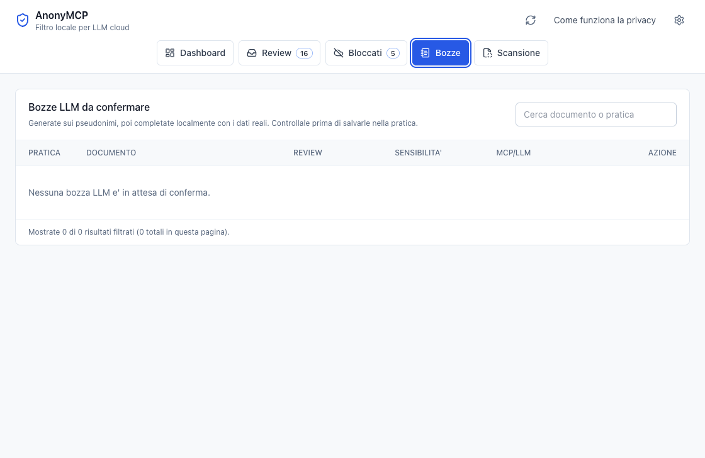

**Cosa stai vedendo**

In questa sessione sintetica non ci sono bozze in attesa. Quando ci saranno, la pagina mostrera'
testi generati sui pseudonimi e completati localmente prima del salvataggio nella pratica.

**Cosa devi controllare**

Una bozza non va considerata gia' salvata. Va letta e confermata localmente.

**Errore da evitare**

Non pensare che la bozza sia un nuovo invio al cloud: il flusso corretto e' LLM sui pseudonimi,
AnonyMCP locale, poi cartella pratica dopo conferma.

## Checklist finale

Prima di usare AnonyMCP con un flusso reale, rispondi a queste domande:

- Sto usando una versione autorizzata per dati reali, non una beta di test?
- La cartella configurata e' quella corretta?
- I codici pratica esposti al MCP sono opachi?
- UI e client LLM usano lo stesso file di configurazione?
- Ho aperto ogni documento da review?
- Ho controllato originale locale, anteprima pseudonimizzata ed entita' rilevate?
- Il documento contiene dati sensibili, minori, salute o penale?
- La colonna MCP/LLM dice davvero che il documento e' disponibile?

Se una risposta non e' chiara, non procedere con l'esposizione al LLM cloud.

## Nota sugli screenshot

Gli screenshot di questa guida sono stati creati con `mcp-electron` su pratiche sintetiche generate
dal progetto.

- Config usata: `/private/tmp/anonymcp-guide-pratiche/anonymcp.config.json`.
- Folder MCP sintetici: `400f`, `215s`.
- Schermate catturate: privacy, aggiunta pratiche, dashboard/config, scansione, review, bloccati,
  documento sensibile, bozze vuote.
- Nessuna pratica reale e nessun documento reale sono stati aperti o catturati.

